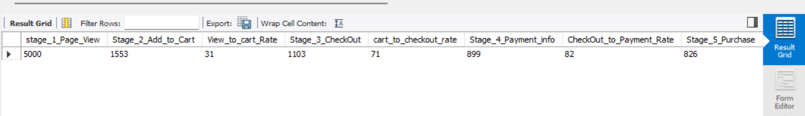
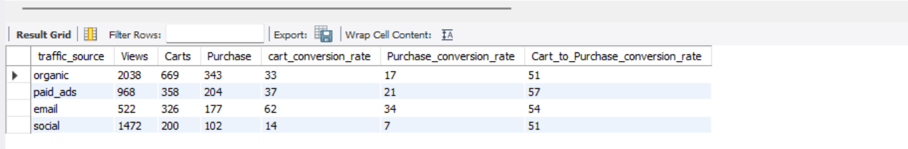
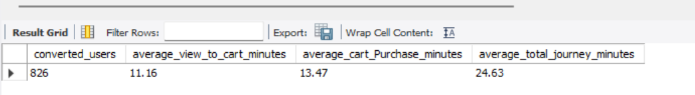
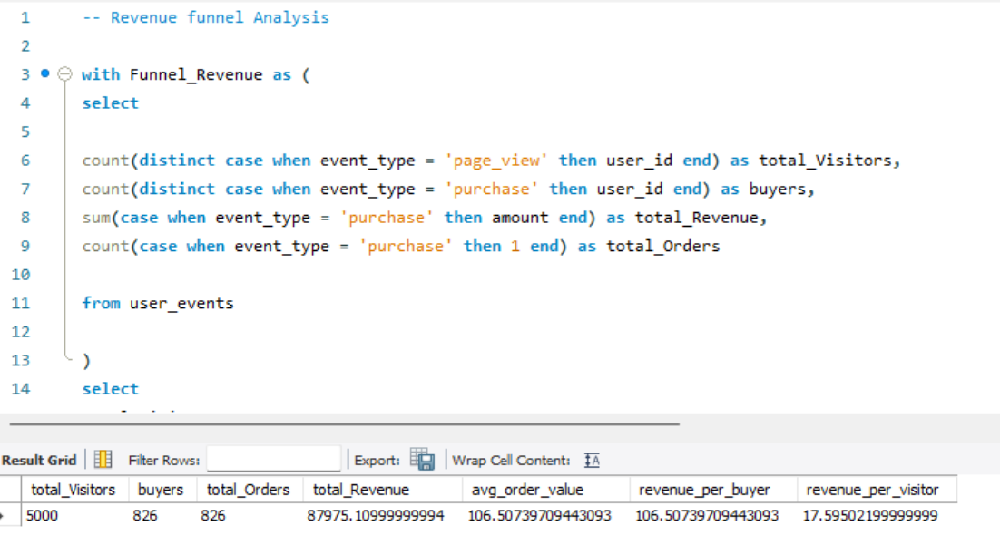
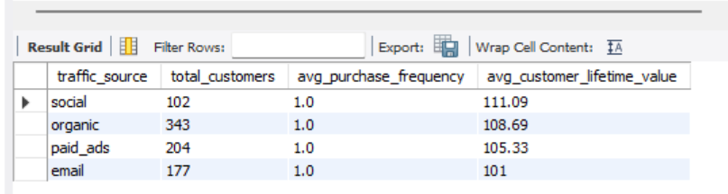
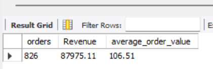
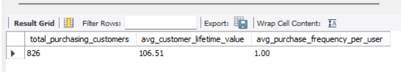
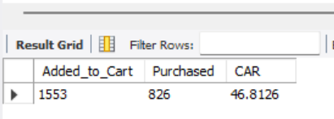
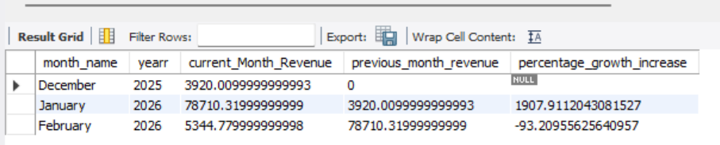

  
  # 🛒 E-Commerce Customer Funnel & Revenue Analytics Using SQL
Customer Funnel, Marketing Performance and Revenue Analytics using SQL to identify conversion opportunities and support data-driven business decisions.

---

## **Project Overview** ##

This project analyzes customer behavior throughout the e-commerce purchasing funnel using SQL. The analysis focuses on conversion performance, marketing effectiveness, customer value, and revenue generation to support data-driven business decisions.

---

## **Business Problem** ##

Although the business receives significant website traffic, management lacks visibility into customer behavior across the purchasing journey.

The objective of this project is to identify where customers abandon the funnel, evaluate marketing channel performance, measure customer value, and provide recommendations to improve conversions and revenue.

---

## **Objectives** ##

- Evaluate customer acquisition funnel.
- Measure conversion performance.
- Compare traffic source effectiveness.
- Analyze customer lifetime value.
- Calculate average order value.
- Measure purchase frequency.
- Evaluate cart abandonment.
- Analyze revenue trends.
- Develop business recommendations.

---

## **Dataset** ##

[User Events ](Dataset/user_events.csv)

---

## **SQL Techniques** ##

- CTEs
- Window Functions
- Group By
- Date Functions
- Aggregate Functions

---

## **Project Workflow** ##

Raw Data

↓

SQL Cleaning

↓

Exploratory Analysis

↓

Business Questions

↓

Insights

↓

Recommendations

---

## **Business Questions** ##

### **1.	How do customers progress through the purchasing funnel?** ###

[SQL Query: Funnel Stages](SQL/01_Funnel_Stages.sql)

**Result**

**Finding**

The purchasing funnel begins with 5,000 page views, but only 826 customers complete a purchase, resulting in an overall conversion rate of approximately 17%.

**Business Insight**

The largest customer drop-off occurs between the Page View and Add to Cart stages, where nearly 69% of visitors leave without showing purchase intent. This suggests that the primary opportunity for improving conversions lies in increasing product engagement rather than optimizing the checkout process.

**Business Impact**

Improving product page content, pricing visibility, product recommendations, and call-to-action buttons could significantly increase the number of customers progressing through the purchasing funnel.

### **2.	What is the overall conversion rate through the funnel?** ###

[SQL Query: Conversion Rate](SQL/02_Conversion_Rate_Through_the_Funnel.sql)

**Result**

**Finding**

The website converts 17% of visitors into paying customers.

**Business Insight**

A 17% conversion rate indicates that while the business successfully converts a portion of its traffic, there remains substantial opportunity to improve conversion efficiency by reducing customer drop-offs earlier in the buying journey.

**Business Impact**

Even a modest improvement in conversion rate would directly increase revenue without requiring additional marketing expenditure.

### **3.	Which marketing channels generate the highest conversions?** ###

[SQL Query: Traffic Source Analysis](SQL/03_Funnel_By_Source.sql)

**Result**

**Finding**

| Channel        | Conversion Rate |
| -------------- | --------------: |
| Email          |         **34%** |
| Paid Ads       |         **21%** |
| Organic Search |         **17%** |
| Social Media   |          **7%** |

**Business Insight**

Email Marketing is the highest-performing acquisition channel, converting nearly one in three visitors into customers. In contrast, Social Media generates the weakest conversion performance despite contributing significant website traffic.

**Business Impact**

Marketing investment should prioritize high-converting channels such as Email Marketing while optimizing Social Media campaigns for lead generation and remarketing rather than direct sales.

### **4.	How long does it take customers to convert?** ###

[SQL Query: Time to Conversion Analysis](SQL/04_Time_To_Conversion_Analysis.sql)

**Result**

**Finding**

**Average customer journey:**

- View → Cart: 11.16 minutes
- Cart → Purchase: 13.47 minutes
- Total Journey: 24.63 minutes

**Business Insight**

Customers complete their purchasing journey in less than 25 minutes on average, indicating a relatively efficient decision-making and checkout process.

**Business Impact**

Since customers convert quickly, timely interventions such as limited-time offers, abandoned-cart reminders, and personalized recommendations could further improve conversion rates.

### **5.	How does revenue accumulate throughout the purchasing funnel?** ###

[SQL Query: Revenue Funnel](SQL/05_Revenue_Funnel_Analysis.sql)

**Result**

**Finding**

- Visitors: 5,000
- Buyers: 826
- Revenue: $87,975
- Average Order Value: $106
- Revenue per Visitor: $17.60

**Business Insight**

Each visitor generates approximately $17.60 in revenue on average, while each customer contributes an average of $106 per transaction. This demonstrates that increasing visitor-to-buyer conversion would have a meaningful impact on total revenue.

**Business Impact**

Improving customer acquisition quality and conversion efficiency offers greater revenue potential than focusing solely on increasing website traffic.

### **6.	Which traffic sources generate the highest Customer Lifetime Value?** ###

[SQL Query: Customer Lifetime Value](SQL/06_Average_Customer_lifetime_value.sql)

**Result**

**Finding**

| Traffic Source | Average CLV |
| -------------- | ----------: |
| Social         | **$111.09** |
| Organic        | **$108.69** |
| Paid Ads       | **$105.33** |
| Email          | **$101.00** |

**Business Insight**

Although Social Media has the lowest initial conversion rate, customers acquired through this channel generate the highest lifetime value. This suggests that while Social Media performs poorly in acquiring immediate purchases, it attracts customers with strong long-term revenue potential.

**Business Impact**

Marketing decisions should balance conversion rate and customer lifetime value, ensuring that acquisition strategies consider long-term profitability rather than immediate sales alone.

### **7.	What is the Average Order Value?** ###

[SQL Query: Average Order Value](SQL/07_Average_Order_value.sql)

**Result**

**Finding**

Average Order Value equals $106.

**Business Insight**

The business generates strong revenue per transaction, providing opportunities to further increase profitability through upselling, cross-selling, and bundled product offers.

**Business Impact**

Small improvements in Average Order Value could significantly increase overall revenue without requiring additional customer acquisition.

### **8.	How frequently do customers purchase?** ###

[SQL Query: Purchase Frequency](SQL/08_Purchase_frequency.sql)

**Result**

**Finding**

Average Purchase Frequency equals 1 purchase per customer.

**Business Insight**

Most customers make only a single purchase, indicating limited customer retention and repeat purchasing behavior.

**Business Impact**

Introducing loyalty programs, personalized email campaigns, and post-purchase engagement strategies could increase repeat purchases and improve customer lifetime value.

### **9.	What is the Cart Abandonment Rate?** ###

[SQL Query: Cart Abandonment Rate](SQL/09_Cart_Abandonment_Rate.sql)

**Result**

**Finding**

The Cart Abandonment Rate is 46%.

**Business Insight**

Almost half of customers who add products to their cart fail to complete the purchase. This represents a significant source of unrealized revenue.

**Business Impact**

Implementing abandoned-cart email reminders, exit-intent offers, and simplified checkout messaging could recover a meaningful proportion of lost sales.

### **10.	How does revenue change over time?** ###

[SQL Query: Revenue Trend](SQL/10_Revenue_Trend.sql)

**Result**

**NB:**

- The dataset only contains part of December and February.
- January includes a promotion or seasonal event.
- January contains most of the available transactions.
- The dataset spans only a few weeks in December and February.

**Finding**

The majority of recorded revenue occurred during January 2026, with substantially lower revenue observed in December 2025 and February 2026.

**Business Insight**

The monthly revenue distribution appears highly concentrated in January. This trend is likely influenced by the reporting period captured in the dataset rather than reflecting complete monthly business performance.

**Business Impact**

Additional historical data covering complete months would provide a more reliable basis for identifying genuine seasonal trends and forecasting future revenue.

---

## **Key Insights** ##

- Social Media generated high traffic but low conversion.
- Email Marketing achieved the highest conversion rate.
- Checkout performance exceeded 80%, indicating an efficient payment process.
- Average Order Value reached $106.
- Customer acquisition costs should remain below the average profit generated per customer.

---

## **Business Recommendations** ##

### User Experience ##
**Preserve the Checkout Experience**

Checkout-to-purchase conversion exceeds 80%, indicating a highly efficient payment process.

**Recommendation**

Avoid redesigning the checkout flow unless a critical issue arises. Instead, focus optimization efforts on earlier stages of the customer journey where the largest drop-offs occur.

### Marketing Strategy ###
**Optimize Marketing Spend**

Although Social Media generated approximately 30% of website traffic, it delivered the lowest conversion rate.

**Recommendation**

Reduce budget allocated to traffic-focused social campaigns and redirect investment toward retargeting and lead generation strategies.

### Expand Email Marketing ###

Email Marketing achieved the highest conversion rate (34%).

**Recommendation**

Increase email acquisition through website pop-ups, lead magnets, and abandoned cart campaigns to capitalize on this high-performing channel.

### Financial Strategy ###
**Improve Customer Acquisition Efficiency**

Average Order Value is $106.

**Recommendation**

Maintain Customer Acquisition Cost (CAC) below $30–$40 to preserve healthy profit margins. Monitor campaign ROI regularly and pause underperforming campaigns.

---

## **Skills Demonstrated** ##

SQL

Business Analytics

Marketing Analytics

Customer Behavior Analysis

Revenue Analysis

Conversion Funnel Analysis

Window Functions

Aggregate Functions

Common Table Expressions

Problem Solving

---

## **Contact** ##

If you would like to discuss this project or connect professionally, feel free to reach out through my [GitHub profile](https://github.com/tanakamotsi03-glitch) or [LinkedIn](https://www.linkedin.com/in/tanaka-motsi-758139417/).

