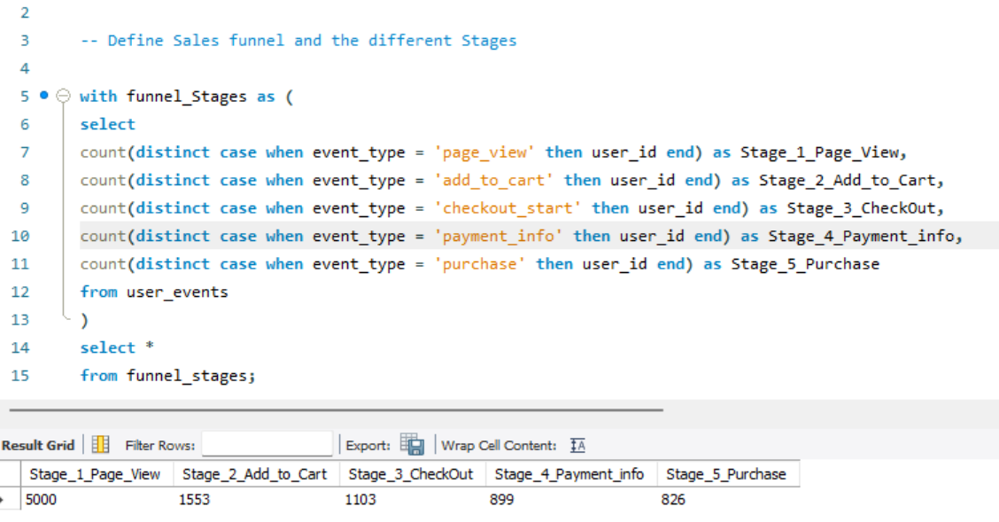

  
  # 🛒 E-Commerce Customer Funnel & Revenue Analytics Using SQL
Customer Funnel, Marketing Performance and Revenue Analytics using SQL to identify conversion opportunities and support data-driven business decisions.

---

## **Project Overview** ##

This project analyzes customer behavior throughout the e-commerce purchasing funnel using SQL. The analysis focuses on conversion performance, marketing effectiveness, customer value, and revenue generation to support data-driven business decisions.

---

## **Business Problem** ##

Although the business receives significant website traffic, management lacks visibility into customer behavior across the purchasing journey.

The objective of this project is to identify where customers abandon the funnel, evaluate marketing channel performance, measure customer value, and provide recommendations to improve conversions and revenue.

---

## **Objectives** ##

- Evaluate customer acquisition funnel.
- Measure conversion performance.
- Compare traffic source effectiveness.
- Analyze customer lifetime value.
- Calculate average order value.
- Measure purchase frequency.
- Evaluate cart abandonment.
- Analyze revenue trends.
- Develop business recommendations.

---

## **Dataset** ##

User Events

---

## **SQL Techniques** ##

- CTEs
- Window Functions
- Group By
- Date Functions
- Aggregate Functions

---

## **Project Workflow** ##

Raw Data

↓

SQL Cleaning

↓

Exploratory Analysis

↓

Business Questions

↓

Insights

↓

Recommendations

---

## **Business Questions** ##

### **1.	How do customers progress through the purchasing funnel?** ###

SQL/01_Funnel_Stages.sql

**Result**

**Finding**

The purchasing funnel begins with 5,000 page views, but only 826 customers complete a purchase, resulting in an overall conversion rate of approximately 17%.

**Business Insight**

The largest customer drop-off occurs between the Page View and Add to Cart stages, where nearly 69% of visitors leave without showing purchase intent. This suggests that the primary opportunity for improving conversions lies in increasing product engagement rather than optimizing the checkout process.

**Business Impact**

Improving product page content, pricing visibility, product recommendations, and call-to-action buttons could significantly increase the number of customers progressing through the purchasing funnel.

---

## **Key Insights** ##

- Social Media generated high traffic but low conversion.
- Email Marketing achieved the highest conversion rate.
- Checkout performance exceeded 80%, indicating an efficient payment process.
- Average Order Value reached $106.
- Customer acquisition costs should remain below the average profit generated per customer.

---

## **Business Recommendations** ##

### User Experience ##
**Preserve the Checkout Experience**

Checkout-to-purchase conversion exceeds 80%, indicating a highly efficient payment process.

**Recommendation**

Avoid redesigning the checkout flow unless a critical issue arises. Instead, focus optimization efforts on earlier stages of the customer journey where the largest drop-offs occur.

### Marketing Strategy ###
**Optimize Marketing Spend**

Although Social Media generated approximately 30% of website traffic, it delivered the lowest conversion rate.

**Recommendation**

Reduce budget allocated to traffic-focused social campaigns and redirect investment toward retargeting and lead generation strategies.

### Expand Email Marketing ###

Email Marketing achieved the highest conversion rate (34%).

**Recommendation**

Increase email acquisition through website pop-ups, lead magnets, and abandoned cart campaigns to capitalize on this high-performing channel.

### Financial Strategy ###
**Improve Customer Acquisition Efficiency**

Average Order Value is $106.

**Recommendation**

Maintain Customer Acquisition Cost (CAC) below $30–$40 to preserve healthy profit margins. Monitor campaign ROI regularly and pause underperforming campaigns.

---

## **Skills Demonstrated** ##

SQL

Business Analytics

Marketing Analytics

Customer Behavior Analysis

Revenue Analysis

Conversion Funnel Analysis

Window Functions

Aggregate Functions

Common Table Expressions

Problem Solving

---

## **Contact** ##

